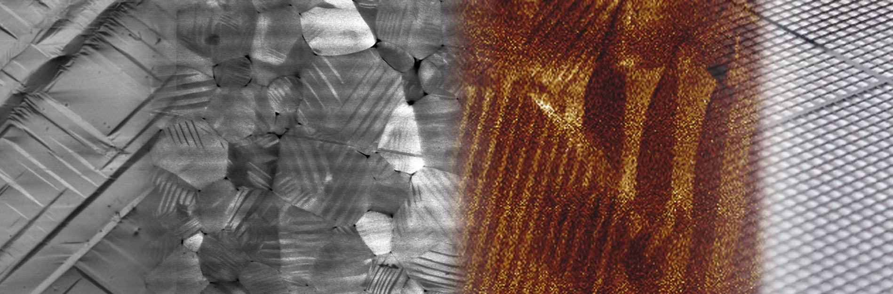
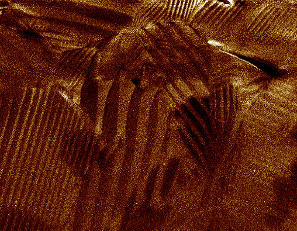
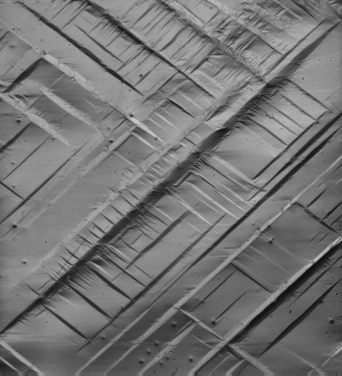

::: {.column-page}

::: {.research-card-grid} 

:::{.research-card-v2} 

<a href="resources/research/exp-mech.qmd" class="card-link"> 

#### Experimental mechanics at the extremes </a> 

::: 

:::{.research-card-v2} 

<a href="resources/research/phase-sma.qmd" class="card-link"> 

 

#### Dynamic phase transformations </a> 

::: 

:::{.research-card-v2} 

<a href="resources/research/arch-wave.qmd" class="card-link"> 

 

#### Wave propagation in microarchitected materials </a> 

::: 

:::{.research-card-v2} 

<a href="resources/research/mult-ferro.qmd" class="card-link"> 

 

#### Mechanics and multi-physical coupling in ferroelectric materials </a> 

::: 

:::{.research-card-v2} 

<a href="resources/research/mag-plast.qmd" class="card-link"> 

 

#### Plasticity and failure at high rates 

</a> 

::: 

:::

:::
