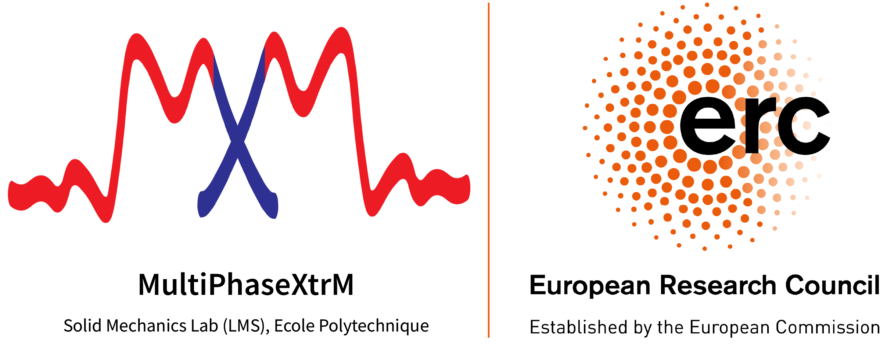

###

:::{.custom-margin}
I am absolutely honored and delighted to announce that we have been awarded a [Starting Grant by the European Research Council (ERC)](https://erc.europa.eu/news-events/news/erc-2025-starting-grants-results). Project MultiPhaseXtrM will investigate the mechanics of phase transformations in shape memory alloys under extreme dynamic conditions.

Many thanks to the incredible colleagues and mentors who guided me through the rigorous proposal preparation phase. And of course, thanks to the ERC for the award. I cannot oversell how excited I am to start building my dream laboratory, towards understanding fascinating science with a cohort of eager, budding scientists. 

On that note, I will be looking out for talented graduate students (masters and PhD) and post-doctoral scientists over the next year. If you are a potential candidate, are excited to be part of the group, enjoy studying mechanics and experimental science, feel free to reach out. 

If you are interested in following the progress of the project, stay tuned. I will soon be creating a page to document milestones through the course of project MultiPhaseXtrM!

* [News article from Polytechnique](https://www.polytechnique.edu/en/news/four-new-erc-starting-grants-awarded-lx-laboratories)       
* [News article from IP Paris](https://www.ip-paris.fr/en/news/four-researchers-institut-polytechnique-de-paris-awarded-erc-starting-grants?trk=feed-detail_main-feed-card_feed-article-content)

:::